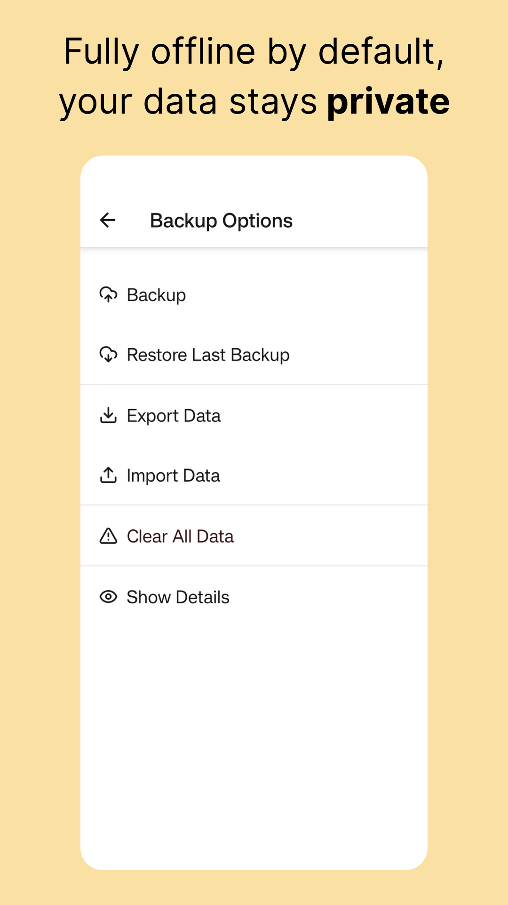

# LangSyne — Remember Your Friends

A mobile app that helps you remember to reach out to the friends you don't see every day.

[](https://play.google.com/store/apps/details?id=app.langsyne)

> **Note:** This repository is a public overview for portfolio purposes. The full production codebase is private.

---

## 📱 Overview

**LangSyne** is an Android & iOS app (React-Native, Expo, TypeScript) with a custom backend (NestJS + Prisma + PostgreSQL on Neon) deployed on Google Cloud Run.

It helps users stay connected to friends across timezones, life stages, and friend groups through:

- Reminders (notification and in-app) when it’s time to reconnect
- Private notes for conversations and memories
- Contact import
- Fully offline storage
- Optional data backup & cloud sync  
- Fast, clean UI

---

## ✨ Features

### 👫 Friend Management

- Add friends with rich metadata (location, relationship type, contact frequency, notes, tags).
- Import iOS/Android contacts.
- Store details such as family members, pets, context notes, etc.  
- Custom avatars, nicknames, and profile badges.

### 🗓️ Interaction Tracking

- Log interactions with details:
  - Date/time  
  - Interaction type (call, message, in-person, etc.)  
  - Modality  
  - Group size + support for multi-friend interactions  
  - Who initiated  
  - Notes and context  
  - “Who was late” tracking  
- Timeline of all past interactions per friend.

### 🔔 Smart Reminders

- Automatic calculation of overdue friendships based on each friend’s configurable “contact frequency”.
- Weekly digest summarizing who to reach out to.  
- Optional push notifications.

### ☁️ Cloud Sync & Backup

- Secure sync via a custom REST API (OpenAPI-generated SDK).
- Encrypted backups stored on PostgreSQL/Neon.  
- Multi-device support.  
- Manual and automatic restore flows.  
- Local SQLite database for offline-first behavior.

### 🎨 Clean UI & Interaction Design

- Built with **Tamagui** for performance and theming.
- Custom header components with avatars, badges, and options menus.  
- Beautiful empty states and onboarding flows.  
- Consistent visual language: warm grey palette, accent themes, curved-arrow diagrams.  
- Smooth navigation via Expo Router.

---

## 🏗️ Architecture

### High-Level Architecture Diagram

```
React Native (Expo, Tamagui)
        |
        |  (OpenAPI SDK, Zod validation)
        ↓
  Backend API (NestJS + Prisma)
        |
 PostgreSQL on Neon
        |
 Google Cloud Run (Docker)
```

### Key Technologies

- **Mobile App (React Native):**
  - **Framework:** Expo
  - **UI:** Tamagui, Lucide React Native
  - **Routing:** Expo Router
  - **State:** Zustand
  - **Data:** SQLite (Expo), Drizzle ORM
  - **Networking:** SWR
  - **Builds:** EAS (local + cloud)
  - **Language:** TypeScript

- **Backend API:**
  - **Framework:** NestJS
  - **Database:** PostgreSQL (Neon)
  - **ORM:** Prisma
  - **Validation:** Zod, Class-Validator
  - **Auth:** JWT, Google Auth Library, Resend
  - **API:** OpenAPI
  - **Hosting:** Dockerized on Google Cloud Run
  - **Language:** TypeScript

- **Web Frontend:**
  - **Framework:** React (Vite)
  - **UI:** TailwindCSS, Radix UI, Lucide
  - **Routing:** React Router
  - **Networking:** SWR
  - **Validation:** Zod
  - **Deployment:** Vercel
  - **Language:** TypeScript

---

## 📂 Project Structure (Conceptual)

This public repo contains:

- README (this file)  
- Screenshots  
- No backend/frontend code

---

## 🎥 Demo

- **Landing page:** COMING SOON
- **Video walkthrough:** COMING SOON

<p align="center">




</p>

---

## 🚀 Notable Technical Challenges Solved

### 1. Offline-first Sync Layer

Designed a custom multi-stage sync system:

- Local SQLite as source of truth while offline  
- Full push/pull diffing  
- Conflict detection  
- Timestamp-based merge  
- Batched operations with rollback  
- OpenAPI client for type-safe requests

### 2. Environment-Specific EAS Builds

Built dev/staging/prod configurations with:

- Separate Google OAuth clients  
- Env-specific API URLs  
- Different bundle identifiers  
- Separate provisioning profiles  
- Staging/production Cloud Run backends  

### 3. Deep Linking Across iOS, Android, and Web

- Custom domain (`langsyne.app`)  
- apple-site-association & assetlinks.json  
- Expo Router integration  
- Magic email links powered by Resend  

### 4. Data Modeling for Relationships

A careful schema covering:

- Friends  
- Interactions  
- interactionFriends (join table)  
- Contact frequency rules  
- Interaction metadata  
- Backups  
- Device linking  
- Email verification tokens  

### 5. Managing Performance on Mobile

- Memoized heavy list items  
- Prewarming routes  
- Virtualized lists tuning  
- Batching UI updates  
- Custom lazy loading  
- Reducing rerenders via stable callbacks and memoized components

---

## 🔒 Why the Source Code Is Private

- Contains proprietary backend logic
- Stores sensitive service configuration (OAuth, backend secrets)
- Prevents misuse of the API endpoints
- Protects IP & future monetization options
- Ensures App Store compliance

This public repo is intended strictly for:

- Recruiters
- Hiring managers
- Portfolio viewers
- Technical collaborators

---

## 🗺️ Roadmap

- TBD

---

## 👨‍💻 About the Developer

**Hi, I’m Michael Hewlett** — AI Engineer & full-stack developer.

I built LangSyne end-to-end:

- System architecture
- Data modeling
- Backend (NestJS + Prisma)
- Mobile app (React Native + Expo)
- Sync layer
- Deployment with Docker + Cloud Run
- EAS build pipeline
- UI/UX design

- LinkedIn: *[add link]*  
- Website: *[optional]*  
- YouTube (AI Engineering): *[add link]*  

---

## 📬 Contact

```
applangsyne@gmail.com
```

Feel free to reach out if you’d like to discuss the architecture, the development process, or opportunities to collaborate.

---